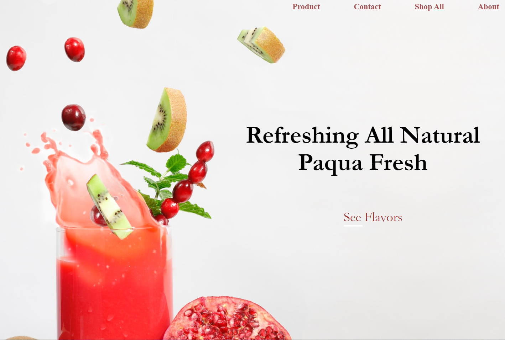

# Paqua   
**Stack:** *HTML and CSS*
**Data Finished (V1):** 8/27/2021

#### **Objective 📈:** **Create a complete website that is responsive, has a moving nav-bar, and has an interesting design.**

**Purpose:** Learn the process of completing an entire website section by section with the emphasis of weaving together a full story.

**Requirements** 🚦 &nbsp;
*• Must be a complete website with: a navbar, a home page, 3 content sections, founder's page and a footer 
• Must be responsive
*

**What's the most technically challenging part of this project and why?**
The most challenging part was nailing a responsive website. I had a hard time switching to the rem measurement and I didn't know when to add media breakpoints to the website.  Through repetition and instant feedback from the chrome dev tools, I was able to test different media widths and find the 3 best breakpoints for the site. Through these media queries, I was able to scale elements and rearrange layouts to improve the overall user experience. 

&nbsp;

##Realizations ⌛️
• Design matters. I noticed some websites didn't use media queries and had a flexbox that was centered. This was because they used an adaptive design over a responsive design
• Using words/numbers after class names can help minimize styling
• Most background photos in websites have a lot of empty space to draw emphasize and allow more space for words
• I could've leveraged the rem measurement by changing the HTML base font size instead of switching measurements to vh and vw

&nbsp;

##Problems 😎

### Major
• **Layouts breaking **
&emsp; &emsp;One specific problem was the beginning landing photo. I had display:block and position:absolute. When switching device chrome tools, 
my design would break after a few changes in devices. Sometimes layouts broke due to elements being too wide or being on the edge.
🔑 *I found the problem by toggling attributes, and narrowing the element. I then deleted the position:absolute. *

• **Nav Bar words wouldn't fit on smaller devices **
&emsp; &emsp; While this isn't a serious problem, removing important content is. By switching to a hamburger navigation bar, all users can access hidden content on mobile. 
🔑* Since the objective is to complete a full website, I didn't implement a hamburger nav bar. *
&nbsp;

###Minor
• **Footer: Layout breaking**
&emsp; &emsp; A minor error caused a major flaw: unnecessary width on items. This caused the site to have excessive space on the right side of the screen. This would specifically get triggered if a person kept toggling between these mobile devices: *surface duo pro, ipad, ipad pro, and iphone x. *
🔑 *I fixed it by hovering over elements and fixing the breaking element*

• **No access to individual NavBar Elements**
Nav-bar elements were hard to access because I made them all share the same li class. I will have to use individual classes next time and use the ul class to bind them. 
🔑 *Adding a number in front of each element fixed this issue. This allows the element to share a class and allow individual selection*

*📚 Resources: *

Logo: https://www.ucraft.com/free-logo-maker
Color Palette: https://coolors.co/ffffff-ffe8d1-568ea3-68c3d4-826251

